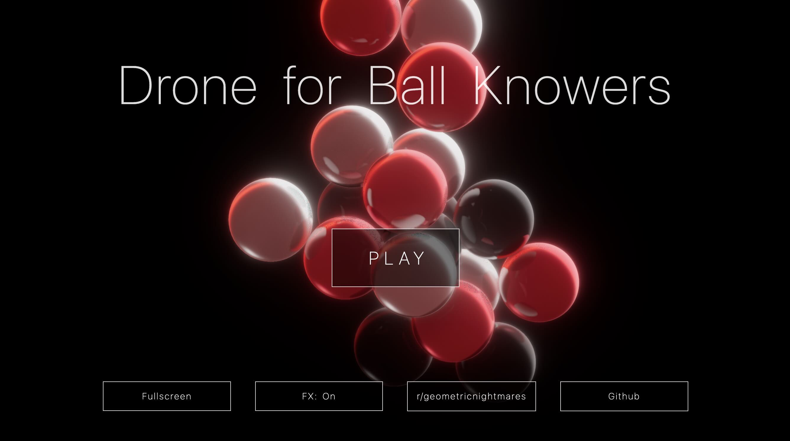

# Drone for Ball Knowers

> WebGPU/[Threlte](https://threlte.xyz/) + [Tone.js](https://tonejs.github.io/) visual sonification experiment

- View the [live demo](https://darosh.github.io/drone-for-ball-knowers/) or watch the [video recording](https://youtu.be/cpNR9oUTRDI)
- Graphics based on [this codesandbox](https://codesandbox.io/p/devbox/ssgi-spheres-with-rapier-physics-forked-5y6dqc?file=%2Fsrc%2FApp.js) via [post by @0xca0a](https://x.com/0xca0a/status/1977379467573023171) 
- _Ball knowers_ term spotted in [post by @katie_dey](https://x.com/katie_dey/status/2004737165784473957)
- Community on [/r/geometricnightmares](https://www.reddit.com/r/geometricnightmares/)
- Wiki pages
  - [Form constant](https://en.wikipedia.org/wiki/Form_constant)
  - [Hypnagogia](https://en.wikipedia.org/wiki/Hypnagogia)
  - [Alice in Wonderland syndrome](https://en.wikipedia.org/wiki/Alice_in_Wonderland_syndrome)
